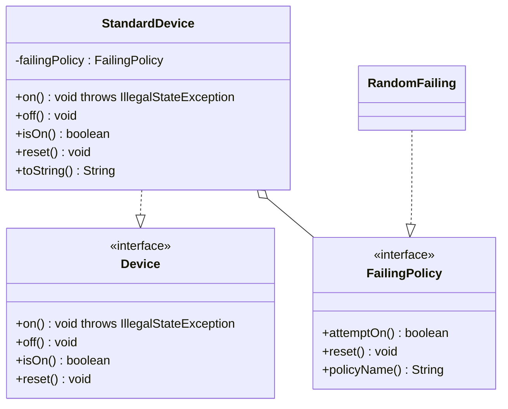
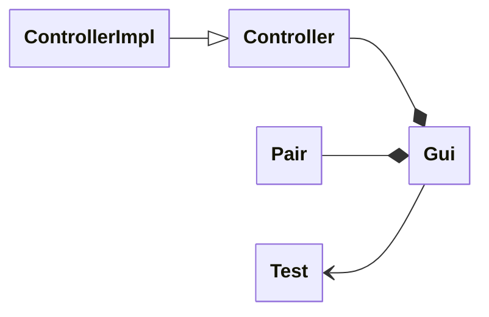

# Laboratory 02

Code available [here](https://github.com/ASMD-Course/asmd23-public-02-testing)

## Objectives
- be operative with Mockito and JUnit
- understand mocking in its details
- exercise with integration testing
- pre-check ability of ChatGPT to help you in unit and integration testing

## Tasks

1. **REORGANIZE**: The repo has a device example, discussed in room. Play with it. Reorganise tests, which are currently grouped by type of mock. Seek
   for the perfect unit test!
2. **TOOLING**: Experiment with installing/using Mockito with Scala and/or in VSCode. Is VSCode better at all here? What’s the state of mocking
   technologies for Scala?
3. **REENGINEER**: Take an existing implemented small app with GUI, e.g. an OOP exam. Add a requirement that it outputs to console some relevant
   messages, through a log class. Now you have an App with at least 3 classes (GUI, Model, Log). How would you write integration tests
   for it? Search here: https://bitbucket.org/mviroli/oop2023-esami (2023, 2022,. . . )
4. **GUI-TESTER**: Generally, GUIs are a problem with testing. How do we test them? How do we automatise as most as possible testing of an app with a
   GUI? Play with a simple example and derive some useful considerations.
5. **TESTING-LLM**: LLMs/ChatGPT can arguably help in write/improve/complete/implement/reverse-engineer a JUnit test, either unit or integration test.
   Experiment with this, based on the above tasks or in other cases. Is ChatGPT useful for all that?

### 1. Reorganize

I've started the exercise by analyzing first the code already present in the repository and showed during the lesson starting 
from the interface `Device.java`:

```java
public interface Device {
    void on() throws IllegalStateException;
    void off();
    boolean isOn();
    void reset();
}
```
Just by looking at the Device interface, we can see observe the various statuses the device can be in. Since this is a 
very simple example we can draw a basic Class Diagram:


Once we have a basic understanding of the code, we can start to reorganize tests.
I've divided those based on the status that a device can be in:

- `Initialization` : How the device behaves when it's just created
- `On` : How the device behaves when it's on
- `Off` : How the device behaves when it's off
- `Reset` : How the device behaves when it's reset

Since I'm using JUnit, I've created separated Nested test classes for each type of test. The root class, `DeviceTest`, 
will contain the code for initializing the mocks used.

```java

public class DeviceTest {

    @Mock
    FailingPolicy stubFailingPolicy;
    @Spy
    RandomFailing spyRandomPolicy;

    @BeforeEach
    void init() {
        MockitoAnnotations.openMocks(this);
    }

    @Nested
    class SwitchingOn {
        //...
    }

    @Nested
    class DeviceInitialization {
        //...
    }

    @Nested
    class SwitchingOff {
        //...
    }

    @Nested
    class SwitchingOn {
        //...
    }
}
```

Every single test in the various classes will trying to cover a single aspect of the device in that specific status. 
As example we show `SwitchingOff` class where we have the following tests: 

```java
@Nested
    class SwitchingOff {
        private Device device;

        @BeforeEach
        void init() {
            device = new StandardDevice(stubFailingPolicy);
        }

        @Test
        @DisplayName("Switching off should set the status correctly")
        void testSwitchingOff() {
            when(stubFailingPolicy.attemptOn()).thenReturn(true);
            device.on();
            device.off();
            assertFalse(device.isOn());
        }

        @Test
        @DisplayName("Switching off multiple time should return the same off status")
        void testSwitchingOffMultipleTime() {
            IntStream.range(0, 2).forEach(i -> {
                device.off();
                assertFalse(device.isOn());
            });
        }
    }
```

### 2. Tooling
For the following tasks I've tried to follow the best practices for installing JVM languages in VSCode using an approach
that can be easily extended to integrate other tools and languages. To do so, I've created a VSCode profile where 
it is possible to install the necessary plugins and configure the environment. A Profile is a set of settings and plugins 
that can be applied to a workspace, it allows to create a custom environment that could be exported and imported to maintain 
consistency across different machines.

> More info about VSCode profiles can be found [here](https://code.visualstudio.com/docs/editor/profiles).

Once the profile is created, I've installed the following plugins:
- Scala Metals (https://marketplace.visualstudio.com/items?itemName=scalameta.metals)
- Scala Syntax (https://marketplace.visualstudio.com/items?itemName=scala-lang.scala)
- Git Support
- Java Language support

The profile actually allows me to run the code easly and have a nice and comprehensive syntax highlighting for both
Scala and Java code.
The only thing that I've not been able to configure easly is the test run management, especially for the Cucumber tests.
Probably it's possible to configure it using the `launch.json` file, but I haven't been able to find a way to do it.
Compared to Intellij IDEA, I've found that VSCode is a bit more lightweight and faster.


*VSCode with Metals*
- *Pros*: I've been able to run the code and have a nice and comprehensive syntax highlighting for both Scala and Java code, lightweight and fast.
- *Cons*: I've not been able to configure the test run management, especially for the Cucumber tests.


Intellij is a more complete IDE, has a full featured Scala plugin and support for testing and debugging. The problem is that it's
heavy and slow, also, sometimes the Scala plugin doesn't work properly (e.g., highlight the code doesn't work, or it reports a variable 
as unused while it's actually used in the code).

*Intellij IDEA*
- *Pros*: Full featured IDE, easy to configure and use, great support for testing and debugging, great support for Cucumber tests.
- *Cons*: Heavy and slow, sometimes the Scala plugin doesn't work properly.


### 3. Re-engineer + 4. GUI-Tester
For this task I've chosen to re-engineer the OOP a01a exam project from 2023 available 
[here](https://bitbucket.org/mviroli/oop2023-esami/src/master/a01a/e2/). I've chosen to implement the logic by myself, so
I've decided to start from the Exercise specifications presented in the application launcher `Test.java`. From these and
the code already present in the repository, It's possible to draw a basic Class Diagram:


This could give us a general idea of the application structure, and a starting point for implementing the logic. I've
adopted a TDD approach, so I've started by creating the `ControllerTest` class. Starting programming by writing tests 
allowed me to gradually identify the methods of the controller class and be able to test them gradually.

The interface `Controller` is now defined as follows:

```java
public interface Controller {

    /**
     * Mark a Cell inside the grid
     * @param cell the position of the cell to mark
     */
    void mark(Pair<Integer, Integer> cell) throws IllegalStateException;

    /**
     * Check if the game is over
     * @return true if the game is over or false otherwise
     */
    boolean isOver();

    /**
     * Return a Map containing the Coordinates for the marked cells as key and the relative counter as value
     * @return a Map of Pairs that indicates the coordinates for the marked cells
     */
    Map<Pair<Integer, Integer>, Integer> getMarkedCells();
}
```

Once I've obtained a stable version of the Controller, I've started to connect it to the GUI. In this case I first create
a Mock Controller for the GUI in order to simulate the behaviour of the real controller and the responses I need to provide
to the GUI.

This is where I've tried to create a way to automate the testing of the GUI. First, in order to do this I need a way to 
interact with the it. The interactions I'm able to perform are quite straightforward, since I need to simulate the user
clicking on the buttons of the grid and handle standard Windows events. 

I've created a separate interface `View` that represents the interactions I'm able to perform with it and using the 
same approach as before I've created a `ViewTest` class where I can test those and the resulting responses with the 
controller. 
It's important to note that the View Interface also contains methods for retrieving the state of the GUI and its final
form is given by using a TDD approach as well.


```java
public interface View {
    /**
     * Shows the view to the user
     */
    void start();

    /**
     * Closes the view
     */
    void close();

    /**
     * Handles a click event on the cell at the given coordinates.
     * @param cell The (x, y) position of the clicked cell.
     */
    void handleCellClick(Pair<Integer, Integer> cell);

    /**
     * Function for closing the application
     */
    default void exitApplication() {
        System.exit(0);
    }

    /**
     * Return the cells of the grid
     * @return a Map where the key are the grid button and the values are the coords of these
     */
    Map<JButton, Pair<Integer, Integer>> getCells();
}
```

Since I want to principally test the GUI, the Controller is mocked with the responses I need to provide to the GUI for 
a given action.
When I've got a stable version of the GUI, I've started to connect it to the real controller and test the integration
between the two. The latter is done by using the `ControllerViewIntegrationTest` class, where I can test the interactions 
between the GUI and the Controller.

After completing the integration tests, I've performed some manual tests to ensure that the application works as expected and then
moved to the next part of this task: extending the application with a Logger.

I've defined the concept of "Logger" as an entity that should be able to show some textual information to the user with 
a relative degree of importance.
The behavior of the Logger should be easy to configure, so I've defined it as a Functional Interface with only one method inside:
```java
@FunctionalInterface
public interface Logger {
    /**
     * Log a string with a priority level
     * @param level The level of logging
     * @param message The message to print
     */
    void log(LogLevel level, String message);
}
```

where `LogLevel` is an enumerator class that contains the various levels of Logging:
```java
public enum LogLevel {
    INFO,
    ERROR
}
```
For now, I print only INFO and ERROR messages, but it's possible to extend it with other levels if needed. I've modified
consequently the `ControllerImpl` class to accept a Logger instance in the constructor and use it to log some
relevant information. After this I've extended both `ControllerTest` and `ControllerViewIntegrationTest` to test the new
functionality provided by the Logger.


### 5. Testing-LLM
I've used ChatGPT to help me improve the tests for the task 3 and 4 described above. As Input I've provided the code of the
interfaces along with the tests that I've already written. 
As prompt I've asked first to reverse engineer the code, trying to figure out what is the purpose of the code and what
are the responsibilities of the classes. LLM did not totally understand the logic of the application, so to totally 
provide it with context it was necessary to pass what was written within the Test.java file.
After this first passage I've asked to write more tests for all the classes.

LLM was able to add the following tests to the classes:
- `ViewTest`:
  - void testClearButtonsBeforeUpdate() {}

- `ControllerViewIntegrationTest`:
  - void testClearButtonsBeforeUpdate() {}

Other tests where tried to add but where redundant with the ones already present in the code. LLM tried to refactory the
code to make it more readable and easier to understand.


